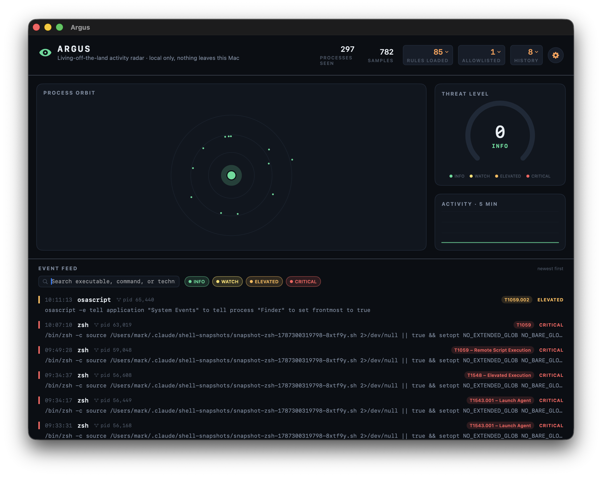

# Argus

A native macOS menu-bar app that watches your Mac's process table in real time
for **living-off-the-land (LOLBin) attack patterns** — malicious use of
Apple's own signed, trusted command-line tools (`osascript`, `curl`, `xattr`,
`launchctl`, `security`, `dscl`, `csrutil`, and others) in the sequences and
argument shapes real adversary tradecraft actually uses. Everything runs
locally; nothing is ever sent anywhere.

See the [build plan](https://claude.ai/code/artifact/d7458060-daa3-4e99-8990-7d5734d821e7)
for the full design rationale.



## Why this, specifically

Modern macOS intrusions increasingly avoid dropping custom malware binaries —
Gatekeeper and notarization make that expensive to get past. Instead they
chain together binaries Apple already ships and already trusts: an
`osascript` privilege-escalation prompt, a `curl | bash` fetch-and-execute, an
`xattr -d com.apple.quarantine` to dodge Gatekeeper, a `launchctl load` for
persistence. No single line looks like a virus. The signal is in the
**sequence and the arguments** — exactly the class of activity a one-shot
file scanner can't see, because there's no file to scan. Argus gives an
individual user that visibility with an interface actually worth glancing at,
without requiring enterprise EDR tooling or kernel entitlements.

## What it looks like

- **Orbit view** — a live radial visualization: every newly-spawned process
  launches from a central node and drifts into orbit; color and size encode
  severity; a parent process still on screen gets an arc drawn to its child,
  so a whole attack chain visually clusters instead of reading as scattered
  log lines.
- **Risk gauge** — an arced meter for the aggregate threat score, which
  decays over time so it reflects recent posture, not a lifetime tally.
- **Event feed** — reverse-chronological, monospaced, severity-striped,
  tagged with the technique it matched; click a row to expand the full
  command line and explanation.
- **Activity sparkline** — rolling 5-minute histogram of matched events.
- **Menu bar icon** — tints calm teal → amber → red with current posture, so
  you get the gist without opening the window.
- **Search & severity filters** — a search field (matches executable,
  command, or technique) plus toggleable severity chips above the feed.
- **Session drill-down** — click the pid on any event to focus the feed on
  every event sharing that process's parent, so a multi-step chain reads as
  one group instead of scattered rows. "Clear" returns to the full feed.
- **Activity history** — a day-by-day heatmap (last ~12 weeks) and a
  top-techniques chart, from the "HISTORY" stat in the header. Matched
  events persist to disk now, so this — and the event feed itself — survives
  a restart instead of resetting to empty.
- **System notifications** — a real macOS notification for matched events at
  or above a threshold you choose (off by default beyond critical-only).
  Authorization is requested once on first launch.
- **Settings** (gear icon in the header) — poll interval and risk-decay
  half-life are tunable now rather than fixed constants, plus the
  notification threshold.

The app is dark-only by design, matching a monitoring-console identity — it
does not follow the system light/dark appearance toggle.

## How detection works

`ProcessMonitor` samples `ps -axww -o pid,ppid,command` roughly every 1.2s
and diffs it against the previous sample to find newly-spawned processes.
Each new process is checked against every active rule; a match becomes an
event with severity, a MITRE technique label, and an explanation.

This is **polling-based, not kernel-event-based** — deliberately. True
exec()-level capture on macOS requires the `endpoint-security` entitlement,
which Apple grants by application review, not something obtainable
unattended in one evening. Polling trades sub-second precision for zero
entitlements and zero permission prompts, which fits a personal visibility
tool better than an enterprise agent. The tradeoff: a process that starts and
exits within the ~1.2s window can be missed as an individual event (though a
parent shell invoking it inline is still visible, since the parent's full
command line is what `ps` reports).

## Rule format and management

Rules are [Sigma](https://github.com/SigmaHQ/sigma) — the open, vendor-
neutral YAML format the wider detection-engineering community actually
publishes in, rather than a bespoke format invented for this app. A rule is
a `logsource` (we only match `category: process_creation`, `product: macos`),
a named `detection` block of field/modifier/value selections
(`CommandLine|contains`, `Image|endswith`, `ParentImage|contains`, `|re`
regex, `|all` for AND-of-list, etc.), and a `condition` string combining
those selections (`selection`, `1 of selection_*`, `all of selection_* and
not 1 of filter_*`, and so on). `Sources/Argus/Sigma/` is a real, if partial,
implementation of that spec: a hand-rolled YAML parser, a condition-language
parser/evaluator, and a field matcher — not a re-skin of the old pattern
list.

**85 rules ship with the app**, sourced from three places:

- **67 rules** imported verbatim from `SigmaHQ/sigma`'s `rules/macos/process_creation/` —
  a real, actively-maintained community ruleset (account/SIP/security-tool
  discovery, LaunchAgent and cron persistence, TCC and keychain access,
  known macOS malware families like XCSSET, and much more).
- **8 rules** imported verbatim from `SigmaHQ/sigma`'s Linux `process_creation`
  set — genuinely portable shell/interpreter techniques (netcat/perl/php/
  python/ruby reverse shells, base64 pipe-to-shell) that apply unchanged on
  macOS, since it's the same shell tooling.
- **10 rules** authored for Argus, filling gaps neither imported set covered
  (TCC.db tampering, browser cookie/session theft, pipe-to-interpreter
  fetch-and-execute, credential piping to `sudo -S`, AMFI/code-signing
  tampering, and others).

See `Resources/Rules/NOTICE.md` for full attribution and license details
(SigmaHQ's rules are DRL 1.1; imported files are unmodified).

**Managing rules**: the gear-adjacent "RULES LOADED" stat in the header
opens a rule browser — search, filter by source, expand a rule to read its
description and raw YAML, and toggle any rule off without deleting it
(persisted, survives restarts). **Adding your own**: drop a `.yml` file
(standard Sigma `process_creation`/`macos` format) into the folder the
"Rules folder" button reveals in Finder, then hit "Reload" — no rebuild
required. A rule you write there shows up tagged "Your rules" in the
browser, exactly like the bundled ones.

## Managing false positives

If a rule fires on something you know is your own legitimate automation,
right-click the event in the feed and choose "Allow future … alerts from
…". This suppresses that specific (rule, executable) pair going forward —
allowlisting one automation's use of `osascript` won't blind Argus to a
*different* technique that happens to also involve `osascript`. Review or
revoke allowlist entries from the "ALLOWLISTED" counter in the header.
Nothing is suppressed silently: the header also shows a running count of
events an allowlist rule has hidden.

## Running it

The built app isn't committed (see `.gitignore`) — only the source and a
build script are. To build and launch:

```bash
./scripts/build_app.sh
open build/Argus.app
```

Requires Xcode command line tools (`xcode-select -p`) and macOS 13+. No
network access, no special permissions, no entitlements to approve.

A rolling diagnostic log is written to `~/Library/Logs/Argus/argus.log`
independent of the UI:

```bash
tail -f ~/Library/Logs/Argus/argus.log
```

Allowlist decisions persist to `~/Library/Application Support/Argus/allowlist.json`.
Matched events persist to `~/Library/Application Support/Argus/events.jsonl`
(newline-delimited JSON, capped at the most recent 5000 — trimmed
periodically rather than on every write, so a live tail will occasionally
see the file shrink back down). Disabled-rule state persists to
`~/Library/Application Support/Argus/rules-state.json`, and your own rule
files live in `~/Library/Application Support/Argus/rules/`.

## Testing

```bash
swift test
```

45 tests. The Sigma engine is validated two ways: `SigmaEngineTests` checks
the YAML parser, condition evaluator, and matcher against real rule text
fetched from SigmaHQ (list-of-selections, `|contains|all`, nested
conditions — not paraphrased), and `BundledRulesTests` loads all 85 shipped
rule files from disk, asserts a few structural invariants (unique IDs,
every condition parses, rule count is the exact expected number so silently
losing a whole directory fails loudly), and — for the 10 Argus-authored
rules, which embed `x-example-match`/`x-example-safe` fixtures — asserts
each one matches what it claims to and doesn't match its benign lookalikes.
That's the rule-count-scales replacement for the old "one hardcoded Swift
sample per rule" pattern, which stopped being practical once the catalog
grew past 20. Also covered: `RuleStoreTests` (enable/disable persistence,
user-rule loading), the allowlist, event history persistence/trimming, the
event feed's filter logic, history aggregation, and settings persistence.

## Project layout

```
Package.swift                  Swift Package Manager manifest (macOS 13+)
Sources/Argus/
  App.swift                    App entry point — main window + MenuBarExtra
  Models.swift                 Severity, RawProcess, ProcessEvent, OrbitNode (Codable)
  Sigma/
    YAMLValue.swift               minimal YAML document tree
    YAMLParser.swift              hand-rolled block-YAML parser
    SigmaRule.swift                rule model + YAML→model mapping
    SigmaCondition.swift           condition-language parser/evaluator
    SigmaMatcher.swift             field/selection matching against a process record
    RuleStore.swift                loads bundled + user rules, enable/disable persistence
  ProcessMonitor.swift          ps polling, diffing, risk-score decay, Sigma matching
  AllowlistStore.swift          persisted (rule, executable) suppression
  EventStore.swift              persisted event history (events.jsonl)
  EventFilter.swift             search/severity/session filter logic
  HistoryStats.swift             day-bucketing + technique-frequency aggregation
  AppSettings.swift              tunable poll interval, decay, notification threshold
  NotificationManager.swift      thin UNUserNotificationCenter wrapper
  DiagnosticsLog.swift          on-disk activity log
  Theme.swift                  color/type tokens
  OrbitView.swift               Canvas-based radial visualization
  GaugeView.swift               arced risk meter
  SparklineView.swift           activity histogram
  DashboardView.swift           main window, event feed, filters, all panels
  MenuBarPanel.swift            compact menu-bar popover
Tests/ArgusTests/
  SigmaEngineTests.swift         parser/condition/matcher vs. real SigmaHQ rule text
  BundledRulesTests.swift        all 85 shipped rules load + custom-rule fixtures
  RuleStoreTests.swift           enable/disable persistence, user-rule loading
  AllowlistTests.swift           filter logic + persistence round-trip
  EventStoreTests.swift          history persistence + trimming
  EventFilterTests.swift         search/severity/session filter logic
  HistoryStatsTests.swift        day-bucketing + technique-frequency aggregation
  AppSettingsTests.swift         settings persistence/clamping + notification-threshold logic
Resources/
  Info.plist                   app bundle metadata
  icon_gen.swift                generates the app icon programmatically
  Rules/
    NOTICE.md                     attribution — what's imported vs. authored, and under what license
    SIGMA_LICENSE.txt             SigmaHQ/sigma's license file
    imported/                     67 rules verbatim from SigmaHQ macOS process_creation
    imported-portable/            8 rules verbatim from SigmaHQ Linux process_creation (portable shell techniques)
    custom/                       10 rules authored for Argus, filling gaps in the imported sets
scripts/build_app.sh            release build → signed .app bundle (bundles Resources/Rules)
```

## Non-goals

Not a System Extension, not a blocker/firewall, not a cloud product. It
observes and visualizes; it takes no automated action on your processes, and
nothing about your machine ever leaves it.

## License

Argus's own code and the rules under `Resources/Rules/custom/` are MIT —
see [LICENSE](LICENSE). The rules imported verbatim from SigmaHQ under
`Resources/Rules/imported/` and `imported-portable/` remain under the
[Detection Rule License (DRL) 1.1](https://github.com/SigmaHQ/Detection-Rule-License)
— see [Resources/Rules/NOTICE.md](Resources/Rules/NOTICE.md).
